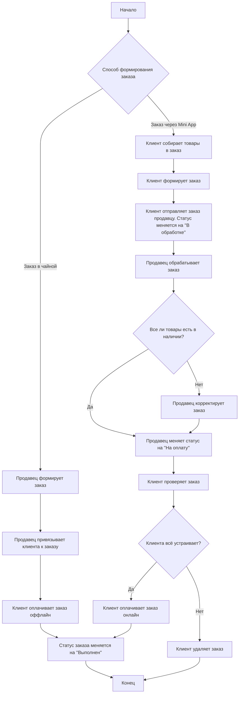

---
modified:
  - 2025-06-03T15:33:14+03:00
  - 2025-05-26T14:52:03+03:00
  - 2025-04-28T15:02:21+03:00
  - 2025-04-27T20:46:01+03:00
created: 2025-04-27T20:22:51+03:00
tags:
  - Диаграммы
---

Связан с [[../../Диаграммы интеграции со Сбис.canvas|Диаграммы интеграции со Сбис]]