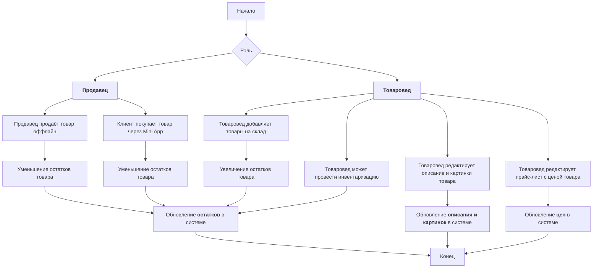
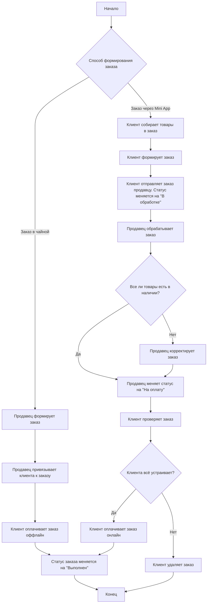

---
modified:
  - 2025-06-03T15:34:02+03:00
  - 2025-04-29T14:11:45+03:00
  - 2025-04-28T16:00:08+03:00
created: 2025-04-28T15:13:54+03:00
---

Связан с [[../../Диаграммы интеграции со Сбис.canvas|Диаграммы интеграции со Сбис]]