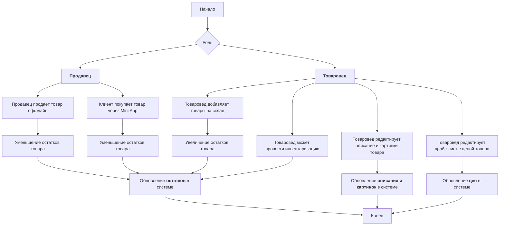

---
modified:
  - 2025-04-29T14:11:45+03:00
  - 2025-04-28T16:00:08+03:00
created: 2025-04-28T15:13:54+03:00
---

```mermaid
flowchart TD

    A[Начало] --> B{Роль}

  

    B --> C[<b>Продавец</b>]

    C --> D[Продавец продаёт товар оффлайн]

    D --> E[Уменьшение остатков товара]

    E --> F[Обновление <b>остатков</b> в системе]

  

    C --> G[Клиент покупает товар через Mini App]

    G --> H[Уменьшение остатков товара]

    H --> F

  

    B --> I[<b>Товаровед</b>]

    I --> J[Товаровед добавляет товары на склад]

    J --> K[Увеличение остатков товара]

    K --> F

  

    I --> L[Товаровед может провести инвентаризацию]

    L --> F

  

    I --> M[Товаровед редактирует описание и картинки товара]

    M --> N[Обновление <b>описания и картинок</b> в системе]

  

    I --> O[Товаровед редактирует прайс-лист с ценой товара]

    O --> P[Обновление <b>цен</b> в системе]

  

    F --> Q[Конец]

    N --> Q

    P --> Q
```
