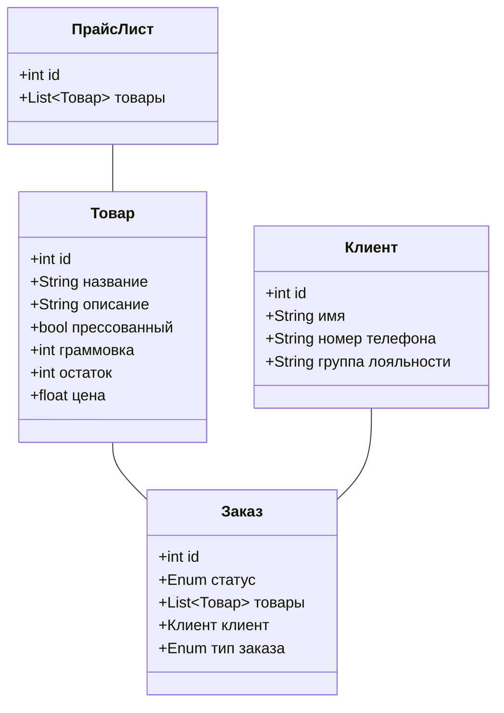
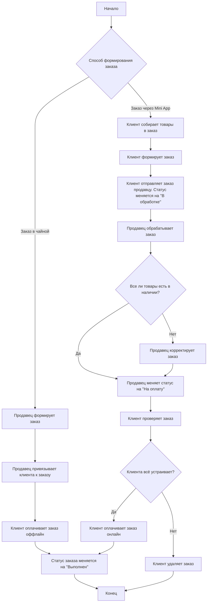

---
modified:
  - 2025-06-03T15:34:10+03:00
  - 2025-06-02T15:18:31+03:00
  - 2025-04-27T19:11:51+03:00
created: 2025-04-27T18:28:42+03:00
---

Связан с [[../../Диаграммы интеграции со Сбис.canvas|Диаграммы интеграции со Сбис]]