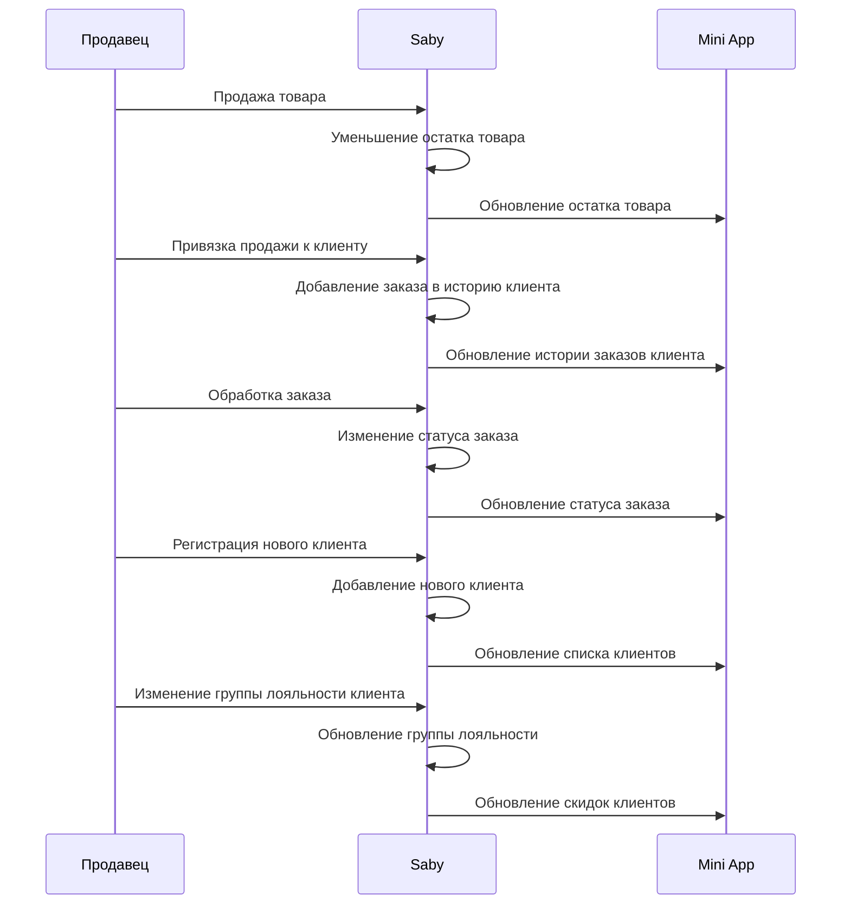
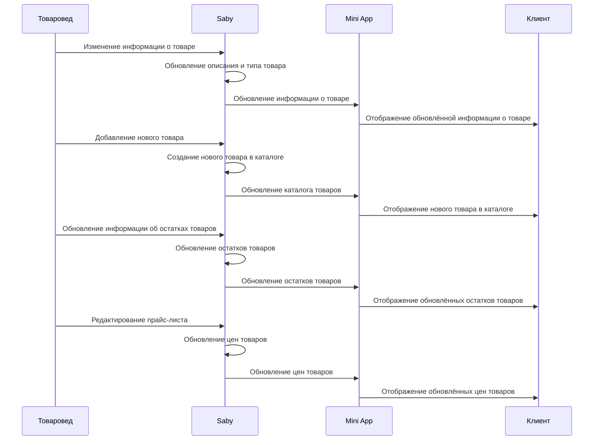
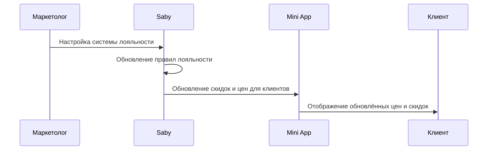
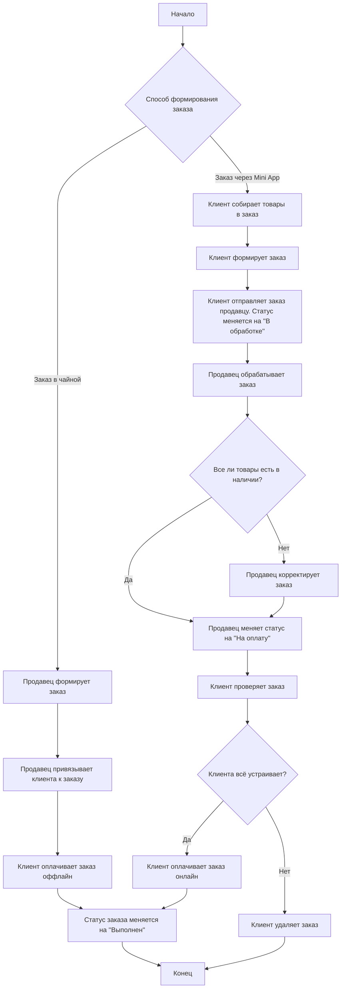

---
modified:
  - 2025-06-03T15:34:24+03:00
  - 2025-04-27T19:24:04+03:00
created: 2025-04-27T19:11:48+03:00
---
# Продавец

# Товаровед

# Маркетолог

Связан с [[../../Диаграммы интеграции со Сбис.canvas|Диаграммы интеграции со Сбис]]